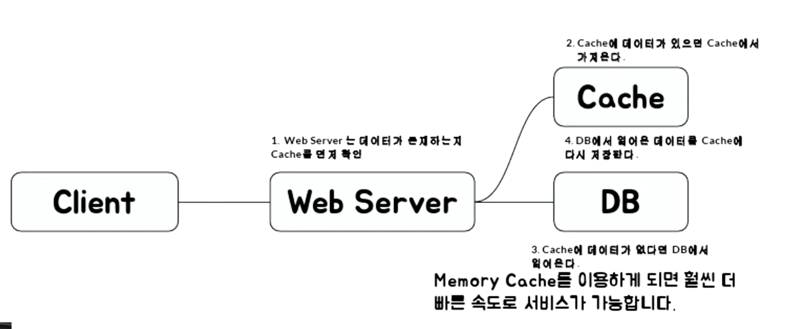
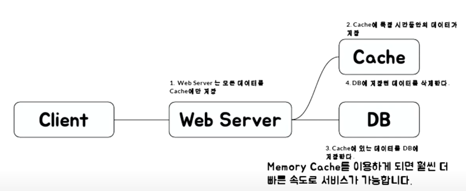
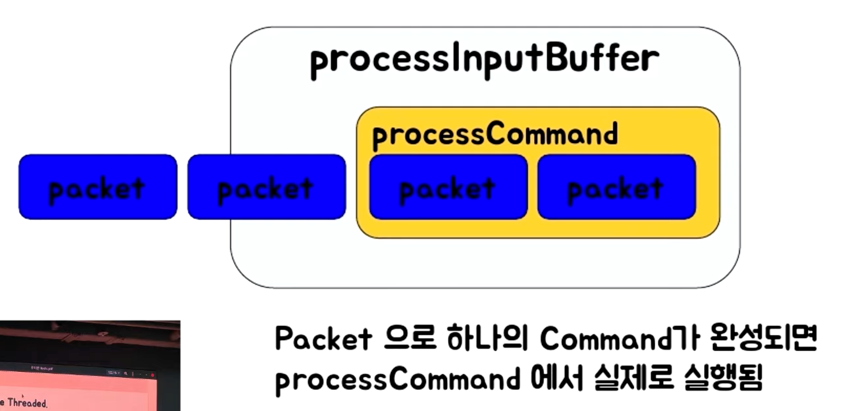

1) Redis 는 어떤 것이고 어떤 식으로 사용할 수 있는가?
2) Reids 기본 기능
3) Redis 운영시 장애 포인트등 잘 쓰는법

### Cache first

Cache 는 나중에 요청을 미리 저쟁하 두었다가 빠르게 서비스를 해주는 것을 의미

### 아주 추상적인 웹서비스 구조

Client -> Web Server -> DB

DB 안에는 많은 데이터들이 있고, 이 때 주로 디스크에 내용이 저장되게 됩니다.

| 2:8 파레토 법칙

전체 요청의 80% 는 20%의 사용자가 요구하고 있다.

### Look Aside Cache

1. Web Server 는 데이터가 존재하는지 Cache 먼저 확인
2. Cache 에 데이터가 있으면 Cache 에서 가져온다.
3. Cache 에 데이터가 없다면 DB 에서 얻어온다.
4. DB 에서 얻어온 데이터를 Cache 에 다시 저장한다.

### Write Back

등록이 너무 빈번하게 발생하면 먼저 Cache 에 담아 두고 일정 시간마다 DB 에 저장하는 전략

insert query 한번씩 500개 VS insert query 한번에 500개

1. Web Server 는 모든 데이터를 Cache 에만 저장
2. Cache 에 특정 시간들만의 데이터가 저장
3. Cache 에 있는 데이터를 DB에 저장
4. DB에 저장된 Cache 데이터를 삭제한다.

> 단점: 처음에 Cache에 먼저 저장되기 때문에 리부팅되면 사라짐 (장애가 생기면 사라짐)
> 사용 예시: 로그를 DB 에 저장할때, 백업할 때

### 왜 Collection 이 중요한가?

**redis 는 Collection 이 제공됨**

- 개발의 편의성 좋아지고
- 개발의 난이도 낮아짐

### 예시. 랭킹 기능 만들기

- 가장 간단한 방법
    - DB에 유저의 Score 를 저장하고 Score 로 order by 로 정렬 후 읽어오기
    - 개수가 많아지면 속도에 문제가 발생할 수 있음 (디스크를 사용하기 때문)
- Redis 의 `Sorted Set` 을 이용하면, 랭킹을 구현 할 수 있음
    - 덤으로, Replication 도 가능...
    - 다만 가져다 쓰면 거기의 한계에 종석적이 됨
        - 랭킹에 저장해야할 id가 1개당 100byte라고 했을 때
            - 10명 1K
            - 10000명 1M
            - 100000000명 1G
            - 1000000000000 명 1TB // 10조 명

Redis 의 경우는 자료구조가 Atomic 하기 때문에, 해당 Race Condition 을 피할 수 있다.

- 그래도 잘못짜면 발생함.
    - 따닥 (클릭 두번했을 때..)

## Redis 사용처

- Remote Data Store
    - A서버, B서버, C서버에서 데이터를 공유하고 싶을 때
- 한대에서만 필요하다면 Redis 자체가 Atomic을 보장해준다. (싱글 스레드라..)
- 주로 많이 쓰는 곳들
    - 인증 토큰 등을 저장 (Strings 또는 hash)
    - Ranking 보드로 사용(Sorted Set)
    - 유저 API Limit
    - 자큐(list)

### Redis Collections

- Strings (가장 많이)
- List
- Set
- Sorted Set (가장 많이, store 가 있어 정렬함 -> 너무 큰수는 틀어진다. 1000 이면 1003, 자바스크립트도 비슷해 너무 큰수는 숫자형이 아니라 문자열로 바꿔서 보낸다. Long ->
  String )
- Hash (key 안의 subkey 로 값을 추가함)

### Collection 주의 사항

- 하나의 컬렉션에 너무 많은 아이템을 담으면 좋지 않음
    - 10000개 이하 몇천개 수준으로 유지하는게 좋음
- Expire는 Collection 의 item 개별로 걸리지 않고 전체 Collection 에 대해서만 걸림
    - 즉 해당 10000개의 아이템을 가진 Collection에 expire 가 걸려있다면 그 시간 후에 1000개의 아이템이 모두 삭제

## Redis 운영

- **메모리 관리를 잘하자.**
- O(N) 관련 명령어는 주의하자.
- Replication
- 권장 설정 Tip

### 메모리 관리

- Redis 는 In-Memory Data Store.
- Physical Memory 이상을 사용하면 문제가 발생
    - Swap 이 있다면 Swap 사용으로 해당 메모리 Page 접근시 마다 늦어짐
    - Swap 이 없다면 ?
- Max memory 를 설정하더라도 이보다 더 사용할 가능성이 큼.
- use memory 대신 use memory RSS 값을 모니터링 해야함.

> 메모리 파편화가 발생할 수 있음

많은 업체가 현재 메모리를 사용해서 Swap 을 쓰고 있다는 것을 모를때가 많음(T.T)

큰 메모리를 사용하는 instance 하나보다는 적은 메모리를 사용하는 instance 여러개가 안전함.
유사한 메모리를 가진 여러개 !

### 메모리가 부족할 때는 ?

- Cache is Cash !!
    - 좀 더 메모리 많은 장비로 마이그레이션
    - 메모리가 빡빡하면 마이그레이션 중에 문제가 발생할 수 도..
- 있는 데이터 줄이기
    - 데이터를 일정 수준에서만 사용하도록 특정 데이터를 줄임
    - 다만 이미 Swap 을 사용중이라면, 프로세스를 재시작 해야함.

- 기본적으로 Collection 들은 다음과 같은 자료구조를 사용
    - Hash -> HashTable 을 하나 더 사용
    - Sorted Set -> Skiplist 와 HashTable 을 이용
    - Set -> HashTable 사용
    - 해당 자료구조들은 메모리를 많이 사용함
- 내부적으로 Ziplist 를 사용하도록 하자 !

### Ziplist 구조

- In-Memory 특성 상, 적은 개수라면 선형 탐색을 하더라도 빠르다.

### O(N) 관련 명령어는 주의하자.

- Redis 는 Single Threaded.
    - 그러면 Redis 가 동시에 여러 개의 명령을 처리할 수 있을까?
    - 참고로 단순한 get / set의 경우, 초당 10만 TPS 이상 가능 (CPU속도에 영향을 받습니다.)

Redis is Single threaded

대표적인 O(N) 명령들

- KEYS
- FLUSH ALL, FLUSH DB
- Delete collections
- Get All Collections

### KEYS 는 어떻게 대체할 것인가?

- scan 명령을 사용하는 것으로 하나의 긴 명령을 짧은 여러번의 명령으로 바꿀 수 있다.

### Monitoring Factor

- Redis Info 를 통한 정보
    - RSS (OS 에서 redis 때문에 사용되는 메모리, 주로 단편화가 많이 일어나면 매우 Used Memory 보다 매우 높음)
    - Used Memory (redis 에서 사용하는 메모리)
    - Connection 수
    - 초당 처리 요청 수 (영향을 CPU 에 받음)
- System
    - CPU
    - Disk
    - Network rx/tx

### CPU 100%를 칠 겅우

- 처리량이 매우 많다면? 
  - 좀 더 CPU 성능이 좋은 서버로 이전
  - 실제 CPU 성능에 영향을 받음
    - 그러나 단순 get / set 은 초당 10만 이상 처리가능
- O(N) 계열의 특정 명령이 많은 경우
  - Monitor 명령을 통해 특정 패턴을 파악하는 것이 필요
  - Monitor 잘못쓰면 부하로 해당 서버에 더 큰문제를 일으킬 수 있음 (짧게 쓰는게 좋음)

### 결론

- 기본적으로 Redis 는 매우 좋은 툴
- 그러나 메모리를 빡빡하게 쓸 경우, 관리하기가 어려움
  - 32기가 장비라면 24기가 이상 사용하면 장비 증설 하는 것이 좋음
  - write 가 heavy 할 때는 migration도 매우 주의해야함.
- Client-output-buffer-limit 설정이 핋요

### Redis as Cache

- Cache 일 경우 문제가 적게 발생 
  - Redis 가 문제가 있을 때 DB등의 부하가 어느정도 증가하는 지 확인 필요
  - Consistent Hashing도 실제 부하를 아주 균등하게 나누지는 않음.
    Adaptive Consistent Hashing 을 이용해 볼 수도 있음.

### Redis as Persistent Store

- Persistent Store 의 경우
  - 무조건 Primary / Secondary 구조로 구성이 필요함
  - 메모리를 절대로 빡빡하게 사용하면 안됨.
    - 정기적인 migration 이 필요.
    - 가능하면 자동화 툴을 만들어서 이용
  - RDB / AOF가 필요하다면 Secondary 에서만 구동
-> 최대한 돈을 많이 투자하고 메모리 덜 쓰자

