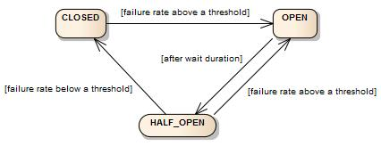

Circuit Breaker가 필요한 이유는, 누전차단기가 전기사고가 발생하기 전에 전기를 미리 차단하는것과 동일하게,
문제가 있는 마이크로서비스로의 트래픽을 차단하여 전체서비스가 느려지거나 중단되는것을 미리 방지하기 위해서 입니다.

Spring Cloud 커뮤니티에서는 EOS(End Of Service: 더 이상 업그레이드와 지원 없음)된 Hystrix의 대안으로 Resilience4J를 권고

Resilience4J는 Java 전용으로 개발된 경량화된 Fault Tolerance(장애감내) 제품입니다.
Resilience4J는 아래 6가지 핵심모듈로 구성되어 있습니다.

- Circuit Breaker: Count(요청건수 기준) 또는 Time(집계시간 기준)으로 Circuit Breaker제공
- Bulkhead: 각 요청을 격리함으로써, 장애가 다른 서비스에 영향을 미치지 않게 함(bulkhead-격벽이라는 뜻)
- RateLimiter: 요청의 양을 조절하여 안정적인 서비스를 제공. 즉, 유량제어 기능임.
- Retry: 요청이 실패하였을 때, 재시도하는 기능 제공
- TimeLimiter: 응답시간이 지정된 시간을 초과하면 Timeout을 발생시켜줌
- Cache: 응답 결과를 캐싱하는 기능 제공

### circuit breaker

https://resilience4j.readme.io/docs/circuitbreaker
CircuitBreaker 는 세 가지 정상 상태(CLOSED, OPEN 및 HALF_OPEN)와 두 가지 특수 상태 DISABLED 및 FORCED_OPEN 이 있는 유한 상태 기계를 통해 구현됩니다.


CircuitBreaker는 슬라이딩 윈도우를 사용하여 호출 결과를 저장하고 집계합니다.
개수 기반 슬라이딩 윈도우와 시간 기반 슬라이딩 윈도우 중에서 선택할 수 있습니다.
카운트 기반 슬라이딩 윈도우는 마지막 N 호출의 결과를 집계합니다.

### Count-based sliding window

윈도우 갯수 크기가 10이면 원형 배열에는 항상 10개의 측정값이 있습니다.

### Time-based sliding window

```
CircuitBreakerConfig circuitBreakerConfig = CircuitBreakerConfig.custom()
        .failureRateThreshold(50)
        .slowCallRateThreshold(50)
        .waitDurationInOpenState(Duration.ofMillis(1000))
        .slowCallDurationThreshold(Duration.ofSeconds(2))
        .permittedNumberOfCallsInHalfOpenState(3)
        .minimumNumberOfCalls(10)
        .slidingWindowType(CircuitBreakerConfig.SlidingWindowType.TIME_BASED)
        .slidingWindowSize(5)
        .recordException(e -> INTERNAL_SERVER_ERROR
                .equals(getResponse().getStatus()))
        .recordExceptions(IOException.class, TimeoutException.class)
        .ignoreExceptions(BusinessException.class, OtherBusinessException.class)
        .build();
```

- name: 서킷브레이커의 이름
- failureRateThreshold: 실패 비율의 임계치
- slowCallRateThreshold: 느린 호출의 임계치
- slowCallDurationThreshold: 느린 호출로 간주할 시간 값
- slidingWindowType: 서킷브레이커의 타입을 지정한다. TIME_BASED, COUNT_BASED 중 택 1
- slidingWindowSize: 시간은 단위 초, 카운트는 단위 요청 수
- minimumNumberOfCalls: 총 집계가 유효해 지는 최소한의 요청 수. 이 값이 1000이라면 999번 실패해도 서킷브레이커는 상태변이가 일어나지 않는다.
- waitDurationInOpenState: OPEN에서 HALF_OPEN으로 상태변이가 실행되는 최소 대기 시간
- permittedNumberOfCallsInHalfOpenState: HALF_OPEN 상태에서 총 집계가 유효해지는 최소한의 요청 수. COUNT_BASED로 slidingWindowType이 고정되어 있다.
- automaticTransition: true라면 waitDurationInOpenState로 지정한 시간이 지났을 때 새로운 요청이 들어오지 않아도 자동으로 HALF_OPEN으로 상태변이가 발생한다.
- ignoreExceptions: 해당 값에 기재한 exception은 모두 실패로 집계하지 않는다.
- recordExceptions: 해당 값에 기재한 exception은 모두 실패로 집계한다.
 

