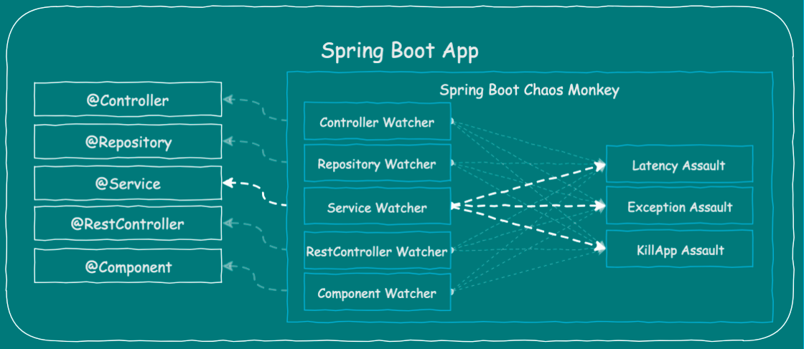

# 카오스 엔지니어링 과 카오스 몽키

카오스 몽키는 간단한 애플리케이션이 "매일 각 클러스터에서 임의의 인스턴스를 선택해서 영업 시간 중 특정 시점에 경고 없이 이 인스턴스를 끄는" 방식으로 진행된다.

카오스 몽키의 개념은 가장 약한 부분이 어디인지 파악하면 엔지니어가 문제에 대처하는 자동화된 트리거를
설정할 수 있고 이를 통해 한밤중에 장애 발생으로 엔지니어가 호출될 일이 없다는 것이다.
이후 카오스 몽키는 카오스 엔지니어링이라는 이름 아래에 종합적인 카오스 원칙으로 발전했다.

# 카오스 엔지니어링 원칙

> 프로덕션 환경의 예측할 수 없는 상황에 버틸 수 있는 확고한 시스템 역량을 구축하기 위한 실험 방법

1. 시스템의 "정상 상태"를 정의해 정상 동작의 기준선을 설정한다.
2. 대조군과 실험군 양쪽에서 모두 이 정상 상태가 계속된다는 가설을 세운다.
3. 서버 멈춤, 하드 드라이버 고장, 네트워크 연결 끊김과 같은 실제 상황을 반영하는 변수를 도입한다.
4. 대조군과 실험군 사이의 차이점을 확인해 가설이 틀렸음을 임증한다.

# 카오스 몽키

- [카오스몽키 깃허브](https://netflix.github.io/chaosmonkey/How-to-deploy/)

카오스 몽키를 사용하려면 [스핀네이커](https://spinnaker.io/) 와 버전 5.6 이상의 MySQL 호환 데이터 베이스도 필요하다.

서비스 소유자가 스핀네이커를 통해 카오스 몽키 구성을 설정한다. 카오스 몽키는 스핀네이커를 통해 작동하면서 서비스가 어떻게 배포되었는지에 대한 정보를 입수하고 지정된 빈도와 일정에 따라 무작위로 인스턴스(가상 머신
또는 컨테이너)를 종료한다

## 종류

카오스 몽키의 종류:

1. Latency monkey: RESTful 클라이언트-서버 통신 계층에 인공적인 지연 유발
2. Conformity monkey: 최상의 조건이 아닌 인스턴스를 찾아 종료 (예:자동 스케이링 그룹에 속하지 않은 인스턴스를 찾아 재시작)
3. Doctor monkey: 인스턴스들의 상태를 점검하고 CPU 부하율 등의 정보들을 모니터링하여 불안정한 인스턴스를 탐지하여 제거
4. Janitoy monkey: 클라우드 환경이 잡음으나 낭비 없이 작동하도록 보장, 사용되지 않는 리소스들을 찾아 제거
5. Security monkey:  Conformity monkey 의 확장으로 보안에 위배되거나 최약점을 찾고 공격하는 인스턴스 종료
6. 10-18 monkey: 다양한 언어와 문자를 사용하여 여러 지역에서 고객에서 서비스를 제공할 경우 설정 및 런타임 문제 감지
7. monkey: AWS 의 가용성 영역을 전체적으로 중단

# Chaos Monkey For Spring Boot (CM4SB)



### 공격 대상

- Watcher : 감시자 (공격 대상 별로 Watcher가 존재)
    - @Controller
    - @Repository
    - @Service
    - @RestController
    - @Component
- Assault : 공격 종류
    - 응답 지연 (Latency Assault)
    - 예외 발생 (Exception Assault)
    - 애플리케이션 종료 (AppKiller Assault)
    - 메모리 누수 (Memory Assault)

[Chaos Monkey for Spring Boot Reference Guide
](https://codecentric.github.io/chaos-monkey-spring-boot/latest/)

| ID                    | 설명                  | Method |
|-----------------------|---------------------|--------|
| /chaosmonkey	         | 현재 카오스 멍키 설정 정보     | Get    |
| /chaosmonkey/status	  | 카오스 멍키 on/off 여부    | Get    |
| /chaosmonkey/enable	  | 카오스 멍키 on           | Post   |
| /chaosmonkey/disable  | 카오스 멍키 off          | Post   |
| /chaosmonkey/watchers | 현재 켜져있는 watchers 정보 | Get    |
| /chaosmonkey/watchers | watchers 정보 수정      | Post   |
| /chaosmonkey/assaults | 현재 켜져있는 assaults 정보 | Get    |
| /chaosmonkey/assaults | assaults 정보 수정      | Post   |
|                       |                     |        |
|                       |                     |        |

```groovy
//Gradle
implementation group: 'de.codecentric', name: 'chaos-monkey-spring-boot', version: '2.3.9'
implementation group: 'org.springframework.boot', name: 'spring-boot-starter-actuator'
```

```yaml
# profile이 chaos - monkey로 되어 있어야 테스트 가능
spring.profiles.active = chaos - monkey

# chaosmonkey endpoints 활성화
management.endpoint.chaosmonkey.enabled = true
management.endpoints.web.exposure.include = health , info , chaosmonkey
```

[관련 블로그](https://effortguy.tistory.com/m/165)
